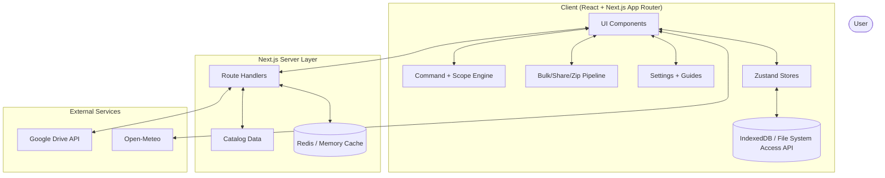
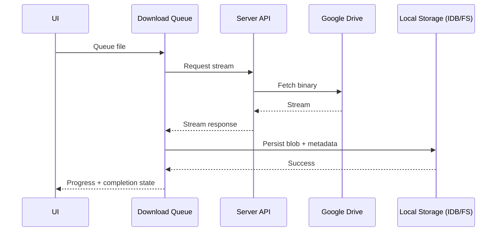
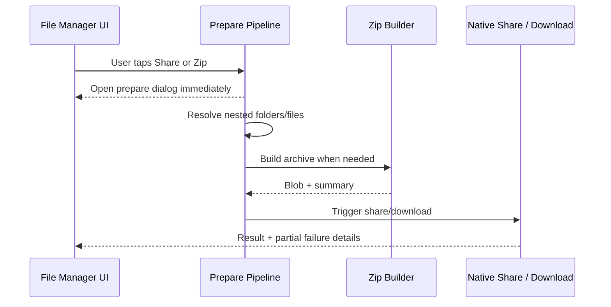

# System Architecture

Studytrix is an offline-first Next.js application with clear client/server boundaries. The client emphasizes resilient storage, responsive command/search UX, and mobile-first interaction flows. The server provides secure Drive proxying, validation, and cache/rate-limit controls.

## High-Level System Overview

## Core Runtime Layers

### Client UI and State

- `components/*` provides app shell, file manager, settings, and feedback surfaces.
- Zustand stores coordinate command, selection, download, offline index, and settings state.
- UI follows immediate-feedback design for long-running actions (prepare dialogs before heavy work).

### Server Proxy and Validation

- Drive requests are server-side only using service-account credentials.
- API routes normalize errors and avoid leaking internal details.
- Route validation protects dynamic department/semester/file params.
- Cache and dedupe reduce repeated upstream load.

## Feature Module Layout

### `features/command`

- Scope-aware indexing and search for global and local folder contexts.
- Prefix-based mode switching (`/`, `#`, `:`, `>`, `@`).
- Nested path discovery support for deeper folder hierarchies.

### `features/offline`

- Storage abstraction with File System Access first, IndexedDB fallback.
- Offline availability index and metadata hydration.
- Storage location setup, migration, relink, and diagnostics.
- Integrity verification and stale cache invalidation.

### `features/download`

- Concurrent queue control with bounded throughput.
- Progress and lifecycle state for batch/individual downloads.

### `features/bulk`

- Multi-entity selection contracts and orchestration.
- Zip + share prepare flows with folder expansion and mixed selection support.
- Copy/download action support for file and folder entities.
- UI feedback integrated with progress dialogs for preparation and execution stages.

### `features/share`

- `share.page.ts` centralizes page-level sharing and copy-link fallback.
- Preserves route/query filters to share current context.

### `features/seo` and PWA metadata surfaces

- Root metadata in `app/layout.tsx` defines global SEO/Open Graph/Twitter behavior.
- Route metadata exports provide page-specific titles/descriptions/canonical URLs.
- Manifest definitions are maintained in `app/manifest.ts` and `public/site.webmanifest`.
- Favicon and launcher icon assets are aligned for browser/PWA install contexts.

### `features/version` and `features/changelog`

- `version.ts` holds app version declaration and dismissal storage keys.
- `changelog.catalog.ts` holds custom curated release entries (not commit-derived).
- Drives changelog page and version update banner visibility.

### `features/settings`

- Typed schema-driven settings registry.
- Searchable settings layout with category sections and mobile quick-nav.
- Settings-integrated guide links to Changelog, Features, and Shortcut Hints pages.
- Object-based greeting preference storage and controls (`greetingPreferences`).

### `features/dashboard`

- Time-period greeting generation with primary/secondary message structure.
- Theme-based secondary messaging (`study`, `motivational`, `minimal`).
- Optional weather-aware enhancement using Open-Meteo weather code mapping.

## Key Flows

### Offline Download Flow

### Share/Zip Prepare Flow

## Product Documentation Surfaces

- `/changelog`: release timeline and detailed highlights.
- `/features`: curated feature catalog.
- `/shortcuts`: keyboard and command-prefix hints.
- `/documentation`: detailed architecture, APIs, limitations, and future scope.
- Settings page links to these pages for in-context discoverability.

## Security and Reliability

- Credentials never shipped to client bundles.
- Strict typing and schema checks across settings, API params, and domain models.
- Redis-first cache/rate-limit behavior with local fallback.
- Defensive error messages and resilient fallback behavior for unsupported browser APIs.
