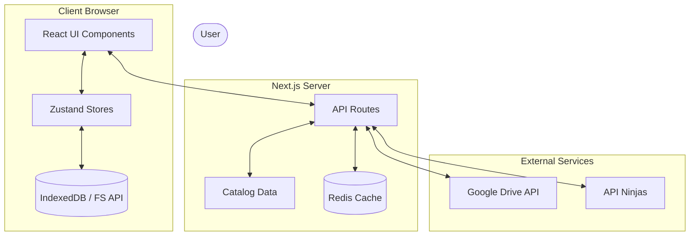
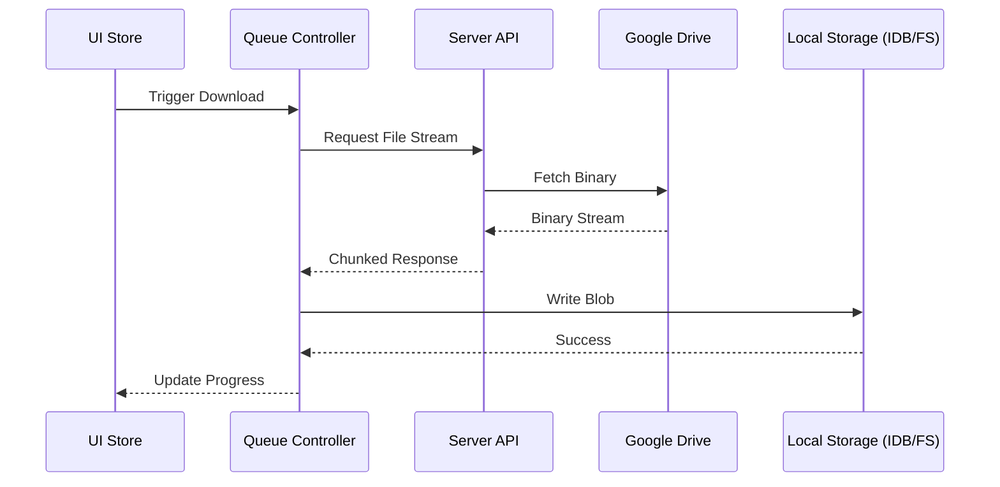

# System Architecture

Studytrix is built as an offline-first, service-oriented Next.js application. It orchestrates between upstream cloud storage (Google Drive), local persistence (IndexedDB/FileSystem API), and high-performance caching layers (Redis).

## High-Level System Overview

## API Layer

### File Stream Endpoint

- Path: `/api/file/[fileId]/stream`
- Returns: streamed binary response
- Features:
  - Safe content headers
  - Drive binary proxy without exposing credentials
  - Deterministic error normalization with diagnostics
  - Rate-limit enforcement

## Feature Module Layout

### `features/drive`

- `drive.service.ts`: Drive folder-list orchestration
- `drive.cache.ts`: cache and in-flight request dedupe
- `drive.rateLimit.ts`: Redis/memory rate limiting
- `drive.types.ts`: normalized transport types

### `features/file`

- `file.service.ts`: raw metadata orchestration
- `file.cache.ts`: TTL metadata cache
- `file.types.ts`: strict metadata types

### `features/offline`

- `offline.storage-location.ts`: Abstraction layer resolving to either native FileSystem Access API or IndexedDB.
- `offline.db.ts`: IndexedDB abstraction
- `offline.rules.ts`: pure download eligibility rules
- `offline.prefetch.ts`: low-priority prefetch logic
- `offline.integrity.ts`: checksum/integrity checks
- `offline.sync.ts`: stale cache invalidation against remote metadata
- `offline.access.ts`: local-first blob access/open helpers
- `offline.index.store.ts`: reactive offline availability snapshot
- `offline.flags.ts`: feature toggle configuration
- `offline.migration.ts`: reset-on-upgrade migration

### `features/download`

- `download.queue.ts`: concurrent priority queue
- `download.controller.ts`: canonical download + persistence orchestration
- `download.store.ts`: reactive state adapter for UI

### `features/bulk`

- `bulk.types.ts`: selection state contracts
- `bulk.share.ts`: orchestration for individual file sharing and client-side ZIP generation
- `bulk.download.ts`: orchestration for batched downloads

### `features/command`

- Contextually aware (local folder scope vs. global workspace scope) search and navigation index.

### `features/dashboard`

- `dashboard.quote.store.ts`: localized daily caching of motivational quotes.

## Offline Data Flow

## Caching and Rate Limiting

- Folder and metadata APIs use cache-first behavior when safe.
- Redis is preferred in production; memory fallback keeps local/dev stable.
- Request dedupe prevents thundering herd on repeated folder requests.
- Per-IP rate limiting protects Google Drive project quota.

## Security Model

- Credentials are read from server env vars only.
- No service account secrets are exposed in client bundles.
- All dynamic route params are validated before service execution.
- Client error payloads are intentionally generic for internal failures.

## Scalability and Reliability

- Streamed binary responses reduce memory pressure.
- Bounded download concurrency avoids browser and network saturation.
- Offline storage supports cleanup and invalidation workflows.
- Schema validation and defensive key checks reduce data corruption risk.
